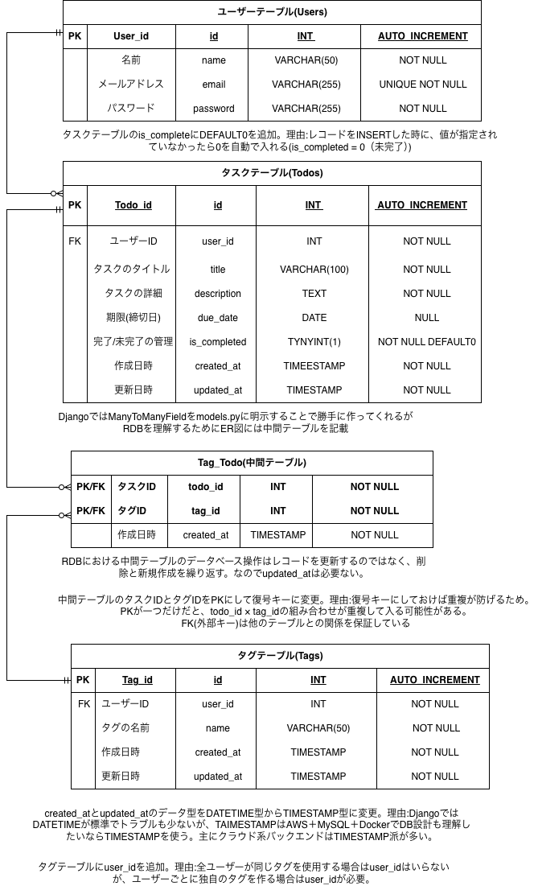
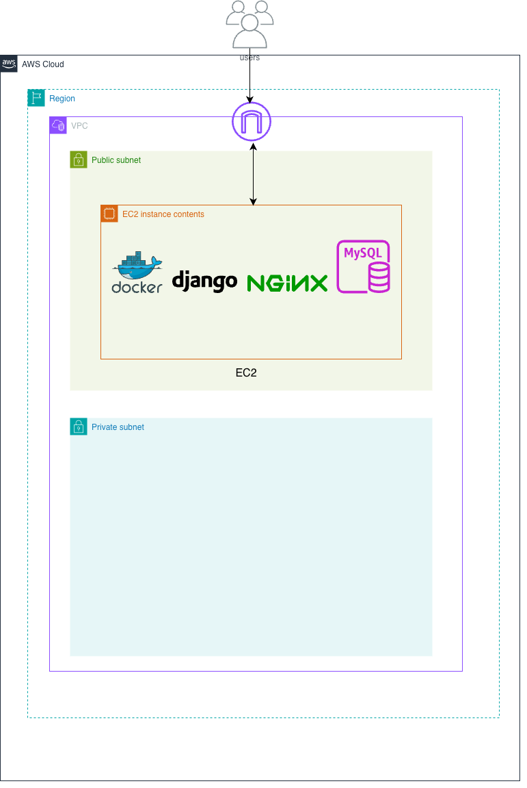
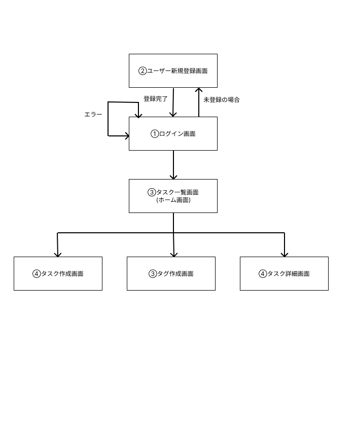

# Todo_app
Django × Docker × MySQL で作る個人用Todoアプリ

## 概要
本アプリは、個人開発のTodo管理アプリです
ユーザー新規登録・ログイン機能を備え、タスクの作成・一覧表示・詳細確認ができます。
タスクにはタグを付けることができ、タグによる絞り込みも可能です。

## 使用技術

### バックエンド
- Python
- Django

### フロントエンド
- HTML
- Bootstrap
- JavaScript(簡単な動作処理)

### データベース
- MySQL
  
### インフラ　・開発環境
- Docker / docker-compose
- AWS(EC2)

##　設計

### ER図

### インフラ構成図

### 画面遷移図

※ URL設計は実装前にNotionで整理した上で開発しています