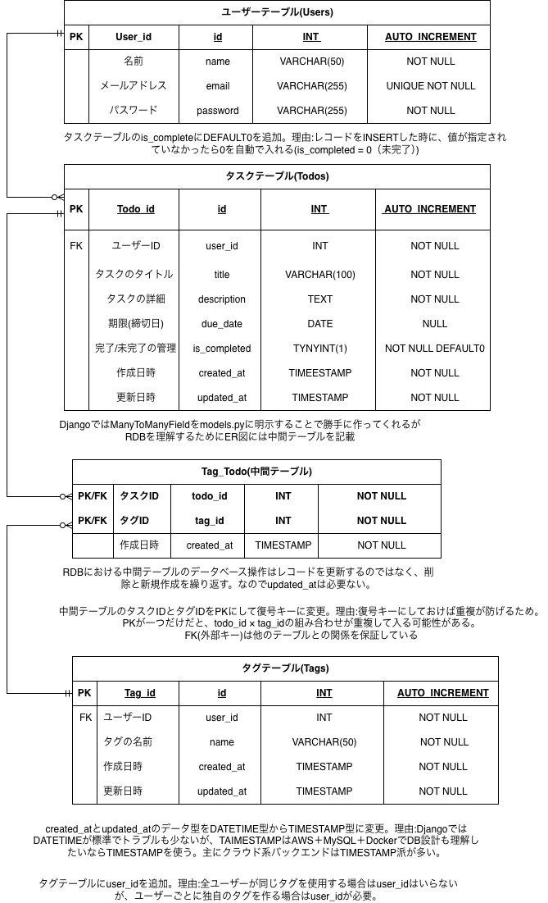
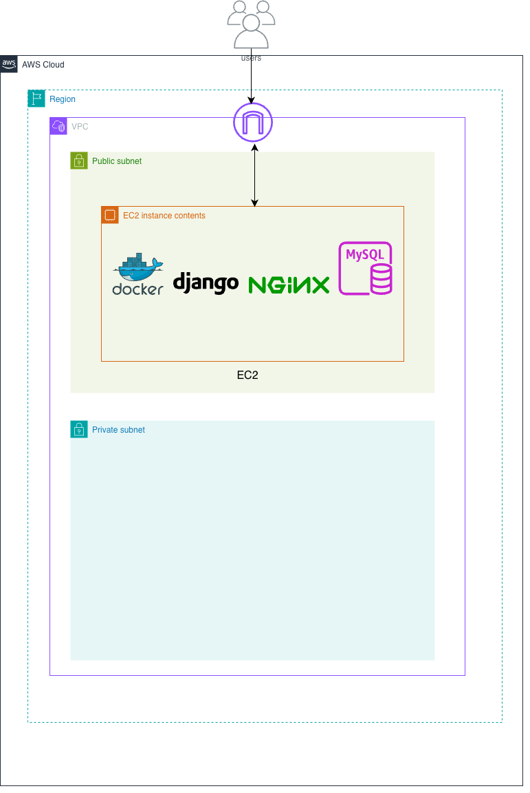
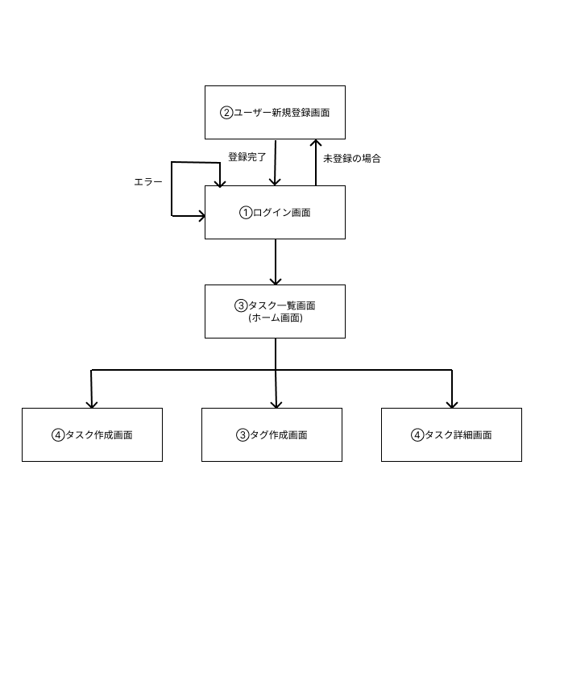

# Todo_app
Django × Docker × MySQL で作る個人用Todoアプリ

## 概要
本アプリは、個人開発のTodo管理アプリです
ユーザー新規登録・ログイン機能を備え、タスクの作成・一覧表示・詳細確認ができます。
タスクにはタグを付けることができ、タグによる絞り込みも可能です。
シンプルな構成の中で、設計から本番デプロイまでを一通り経験することを重視しています。

## 目的
Djangoを用いたWebアプリケーション開発の一連の流れ
(設計 → 実装 → Docker化 → 本番デプロイ)を理解・実践することを目的として作成しました。

## 使用技術

### バックエンド
- Python
- Django

### フロントエンド
- HTML
- Bootstrap
- JavaScript(簡単な動作処理)

### データベース
- MySQL
  
### インフラ　・開発環境
- Docker / docker-compose
- AWS(EC2)

## 設計

### ER図


### インフラ構成図


### 画面遷移図


※ URL設計は実装前にNotionで整理した上で開発しています

## 開発環境(ローカル)

本プロジェクトでは、Pythonの依存関係にPoetryを使用しています。

### 使用バージョン
- Python 3.11
- Django 5.0.6
- Poetry

### セットアップ手順(ローカル)

#### 1. Poetryのインストール(Mac)
```bash
brew install poetry
```
#### 2. 依存関係のインストール
```bash
poetry install
```
#### 3.開発サーバーの起動
```bash
poetry run python manage.py runserver
```
## 実行サーバー構成について

- ローカル開発環境：Django標準の開発用サーバー(`runserver`)を使用
- Docker/本番環境：WSGIサーバーであるGunicornを使用してアプリケーションを起動

Nginx → Gunicorn → Django

## 開発環境の起動(Docker)

Docker / Docker Compose を使用して開発環境を構築します。

```bash
docker compose up --build
```
上記コマンドを実行すると、以下が自動で行われます。
- Python 3.11 環境の構築
- Poetryのインストール
- pyproject.toml/poetry.lockに基づく依存関係のインストール
- Djangoアプリケーションの起動
- Nginxを介したリバースプロキシの有効化

起動後、ブラウザで以下にアクセスしてください。

http://localhost/todos/

※ 本アプリはNginx(80番ポート)経由でDjangoにアクセスする構成になっています。
※ 本アプリでは`/todos/`を起点に画面を表示しています。

## 開発環境の停止

```bash
docker compose down
```

## 環境変数の管理について

本アプリでは、SECRET_KEY や DEBUG などの設定値を`env_file`を通して
Djangoに渡す構成としています。

### .env　の例(ローカル)
```bash
DJANGO_SECRET_KEY=django-insecure-local-key
DJANGO_DEBUG=True
```

※`.env`ファイルは機密情報を含むため、GitHubには含めていません。

### 注意点
- 環境変数は **コンテナ起動時に読み込まれる** ため、`.env`を変更した場合は`docker compose down` → `up`が必要です。
- ローカル環境と本番環境で setting.pyを共通化し、環境差分は`.env`によって切り替える設計としています。 

## 依存関係管理について
 
本プロジェクトでは、Pythonの依存関係管理にPoetryを使用しています。

- pyproject.toml/poetry.lockにより依存関係を管理
- Dockerfile内で`poetry install --no-root`を実行し、アプリケーション本体はvolume経由で利用しています。
- 開発時のコード変更は即座にコンテナに反映されます。

## 工夫した点、学んだこと

- タスクの完了状態を管理するためのフラグをモデルに定義し、実装および動作確認まで行いました。
- Django 5.0ではログアウト処理がPOSTメソッド必須になったため、テンプレートを`<a>`タグから`form`に変更して対応しました。
- SQLiteからMySQLへ切り替え、`mysqlclient`のC拡張ライブラリをDocker環境でビルドするために必要なパッケージをDockerfileに追加しました。
- 本番環境を想定し、DjangoはGunicorn経由で起動し、staticファイルはNginxから配信する構成としました。
- `collectstatic`と`STATIC_ROOT`を設定し、Django開発サーバーと本番構成の違いを意識して実装しました。

## 認証について
- Django標準の認証機能を使用しています。
- ログイン必須ページには`LoginRequiredMixin`を使用し、未ログイン状態ではログイン画面へリダイレクトされます。

### インフラ・開発環境
- Docker / docker-compose
- AWS(EC2) 

## 本番環境(AWS EC2)
- AWS EC2 (Amazon linux)
- Docker / docker-composeによるコンテナ管理
- Nginx + Gunicorn + Django 構成
- 環境変数(SECRET_KEY / DEBUG など)は`.env`で管理
- マイグレーション実行後、タスクの作成・一覧表示・詳細表示・完了状態の切り替え、タグによる絞り込み動作確認済み
- 今後の拡張を見据え、プライベートサブネットを含む構成とし、NAT Gateway等を用いた外部通信制御も検討できる設計としています。


※学習用途のため、本番URLは公開していません。

## 今後の改善予定
- タスクの編集・削除機能の追加
- プライベートサブネットを利用した構成への拡張（NAT Gateway / NAPT の導入）